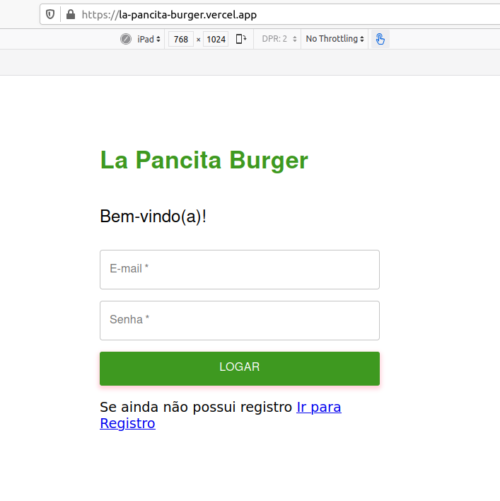

# Burger Queen

Link do projeto - [LaPancitaBurger](https://la-pancita-burger.vercel.app/service)

## Índice

- [1. Resumo do projeto](#1-resumo-do-projeto)
- [2. Aprendizado](#2-aprendizado)
- [3. Histórias do usuário](#3-histórias-do-usuário)
- [4. Planning](#4-planning)
- [5. Protótipos](#5-protótipos)
- [6. Ferramentas e Linguagens de Programação](#-ferramentas-e-linguagens-de-programação)

---

## 1. Resumo do projeto

Trata-se de um projeto 100% por demanda, onde o foco principal foi nos assegurarmos de cumprir todos os requisitos estabelecidos. O nome escolhido para nossa Hamburgueria foi La Pancita Burguer, baseado no personagem do seriado chaves, o Sr barriga, pois em nossa hamburgueria queremos que o cliente entre com fome e saia com uma rica pancita de satisfação.

Sobre:

Somos **La Pancita Burger**, um fast food 24hrs.

La Pancita Burguer é um pequeno restaurante de hambúrgueres, que está crescendo e necessita de uma interface em que se possa realizar pedidos utilizando um _tablet_, e enviá-los
para a cozinha para que sejam preparados de forma ordenada e eficiente.

> A nossa proposta de serviço 24 horas foi muito bem recebida e, para continuar a
> crescer, precisamos de um sistema que nos ajude a receber pedidos de nossos
> clientes.
>
> Nós temos 2 menus. Um muito simples para o café da manhã:
>
> | Ítem                  | Preço R\$ |
> | --------------------- | --------- |
> | Café americano        | 5         |
> | Café com leite        | 7         |
> | Misto Quente          | 10        |
> | Suco de fruta natural | 7         |
>
> E outro menu para o resto do dia:
>
> | Ítem                | Preço   |
> | ------------------- | ------- |
> | **Hambúrgueres**    | **R\$** |
> | Hambúrguer simples  | 10      |
> | Hambúrguer duplo    | 15      |
> | **Acompanhamentos** | **R\$** |
> | Batata frita        | 5       |
> | Anéis de cebola     | 5       |
> | **Bebidas**         | **R\$** |
> | Água 500ml          | 5       |
> | Água 750ml          | 7       |
> | Refrigerante 500ml  | 7       |
> | Refrigerante 750ml  | 10      |
>
> **Importante:** Os clientes podem escolher entre hambúrgueres de carne bovina,
> frango ou vegetariano. Além disso, por um adicional de R\$ 1,00 , eles podem
> adicionar queijo **ou** ovo.
>
> Nossos clientes são bastante indecisos, por isso é muito comum que eles mudem o
> seu pedido várias vezes antes de finalizar.

A interface mostra os dois menus (café da manhã e restante do dia), cada
um com todos os seus _produtos_. O usuário pode escolher que _produtos_
adicionar e a interface mostra o _resumo do pedido_ com o custo total.

.
.
.

## 2. Aprendizado

O objetivo principal do projeto foi aprender a construir uma interface web usando React. Esse framework front-end ataca o seguinte problema: **como manter a interface e estado sincronizados**. Portanto, nessa experiência aprendemos o conceito de estado da tela, e como cada mudança no estado vai refletir na interface (por exemplo, toda vez que adicionamos um _produto_ para um _pedido_, a interface atualiza a lista de pedidos e o total) e foi pensada específicamente para rodar em **tablets**.

## 3. Histórias do usuário

Para o projeto recebemos do Product Owner este backlog, que é o resultado do seu trabalho com o cliente até hoje:

### Definição do produto

#### [História de usuário 1] Usuário deve ter seu perfil (login/senha) para acessar o sistema.

Eu como funcionário do restaurante quero entrar na plataforma e ver apenas a tela importante para o meu trabalho.

##### Critérios de aceitação

O que deve acontecer para satisfazer as necessidades do usuário?

- Criar login e senha.
- Registar tipo de usuário (cozinha / salão), login e senha.
- Entrar na tela correta para cada usuário.

##### Definição de pronto

O acordado abaixo deve acontecer para dizer que a história está terminada:

- Você fez _testes_ de usabilidade e incorporou o feedback do usuário.
- Você deu deploy de seu aplicativo.

---

#### [História de usuário 2] Garçom/Garçonete deve poder anotar o seu pedido

Eu como garçom/garçonete quero poder anotar o meu pedido saber o valor de cada
produto e poder enviar o pedido para a cozinha para ser preparado.

##### Critérios de aceitação

O que deve acontecer para satisfazer as necessidades do usuário?

- Anotar o nome e mesa.
- Adicionar produtos aos pedidos.
- Excluir produtos.
- Ver resumo e o total da compra.
- Enviar o pedido para a cozinha (guardar em algum banco de dados).
- Funcionar bem e se adequar a um _tablet_.

##### Definição de pronto

O acordado abaixo deve acontecer para dizer que a história está terminada:

- Você fez _testes_ de usabilidade e incorporou o _feedback_ do usuário.
- Você deu deploy de seu aplicativo.

---

#### [História de usuário 3] Chefe de cozinha deve ver os pedidos

Eu como chefe de cozinha quero ver os pedidos dos clientes em ordem, poder marcar que estão prontos e poder notificar os garçons/garçonetes que o pedido está pronto para ser entregue ao cliente.

##### Critérios de aceitação

- Ver os pedidos à medida em que são feitos.
- Marcar os pedidos que foram preparados e estão prontos para serem servidos.
- Ver o tempo que levou para preparar o pedido desde que chegou, até ser marcado como concluído.

##### Definição de pronto

- Você fez _testes_ de usabilidade e incorporou o _feedback_ do usuário.
- Você deu deploy de seu aplicativo.

---

#### [História de usuário 4] Garçom/Garçonete deve ver os pedidos prontos para servir

Eu como garçom/garçonete quero ver os pedidos que estão prontos para entregá-los rapidamente aos clientes.

##### Critérios de aceitação

- Ver a lista de pedidos prontos para servir.
- Marque os pedidos que foram entregues.

##### Definição de pronto

- Você fez _testes_ de usabilidade e incorporou o _feedback_ do usuário.
- Você deu deploy de seu aplicativo.
- Os dados devem ser mantidos intactos, mesmo depois que um pedido foi terminado. Tudo isso para poder ter estatísticas no futuro.

## 4. Planning

Nosso planejamento para esse projeto foi feito no Trello, dividido por tesks para cada história do usuário, que se complementavam a cada definição de pronto, de cada história.

.png).

## 5. Protótipos

Com a demanda das histórias já prontas, desenvolvemos nossos protótipos de baixa fidelidade e ao validarmos, começamos o desenvolvimento dos protrótipos de média fidelidade no Marvel [Canvas](https://marvelapp.com/prototype/60b0dai/screen/76802651).

.
.

## 6. Ferramentas e Linguagens de Programação

- Babel
- React Router
- React + Fetch
- Javascript
- Material UI

> | Desenvolvedoras       |  Github                                     |
> | --------------------- | ------------------------------------------- |
> | Jéssica Cavalcante    | https://github.com/JessicaCavalcante        |
> | Lucila Xavier         | https://github.com/Lucilaxavier             |